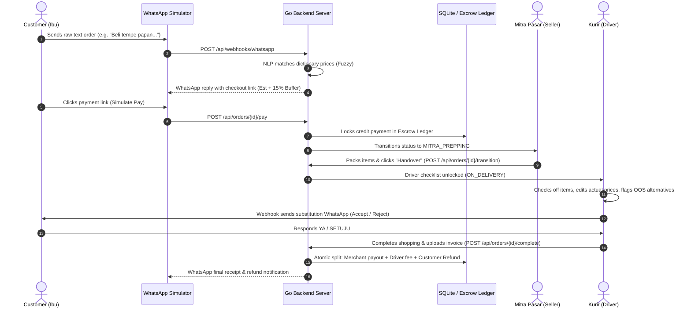

# Emak AI Titip: Product Specifications & Pitch Deck Guide

This document aggregates the Business Requirements Document (BRD), Product Requirements Document (PRD), Technical Documentation, and a slide-by-slide Pitch Deck outline for **Emak AI Titip**, a conversational AI-driven grocery personal shopping (jastip) system for Indonesian traditional markets.

---

## Part 1: Business Requirements Document (BRD)

### 1.1 Executive Summary
Traditional food markets (pasar rakyat) remain Indonesia’s primary source of fresh, high-quality, and affordable raw ingredients. However, modern housewives (Ibu-Ibu) and working professionals find it difficult to shop there due to traffic, time constraints, and a lack of pricing transparency. While on-demand delivery services exist, their supermarket partnerships feature higher pricing, and general personal shopping (jastip) faces a trust deficit.

**Emak AI Titip** bridges this gap by offering a text/voice-based WhatsApp ordering interface, backed by a secure **Escrow Ledger** and merchant-driver checklists, ensuring zero cash advancement risk for couriers and automated refunds for buyers.

### 1.2 Target Audience & Market Size
* **Primary Customers**: Busy mothers, housewives, and young families who value fresh, traditional market produce but lack the time to visit physical stalls.
* **Sellers (Mitra)**: Traditional market stall owners (pedagang pasar) who lack digital presence but want access to online orders.
* **Couriers (Drivers)**: Gig-economy personal shoppers who want guaranteed payout for their labor without advancing their own cash for purchases.
* **Market Opportunity (TAM/SAM/SOM)**: Traditional retail accounts for over **70%** of grocery sales in Indonesia. The TAM consists of Indonesia's $90B grocery market, with a SOM focused on urban centers utilizing on-demand conversational logistics.

### 1.3 Key Problem Statements & Solutions
| Problem | Business Impact | Emak AI Titip Solution |
| --- | --- | --- |
| **High Friction Interface**: Older users find complex food delivery apps confusing. | Low digital adoption for traditional demographics. | **Conversational UI**: User simply chats on WhatsApp via text or voice message. |
| **Cash Advancement Risk**: Drivers are forced to pay out-of-pocket (talangan) for groceries at markets. | High driver churn, disputes, and limitation on order values. | **Escrow Lock**: Customer deposit is secured in escrow before the driver departs. |
| **Volatile Market Pricing**: Pricing in traditional markets fluctuates daily and lacks standardization. | Price disputes, undercharging, or driver markups. | **Buffer Escrow & Refund**: Buyer pays a 15% buffer; unused balance is auto-refunded to their wallet. |

### 1.4 Monetization & Financial Model
* **Transaction Commission (Take Rate)**: 3-5% service fee charged on the real transaction total from merchant partners.
* **Flat Delivery Fee**: Rp 10.000 per order paid directly from the escrow to the driver.
* **B2B SaaS / Premium Listing**: Traditional market merchants pay a monthly subscription for priority placement in the AI matching dictionary.

---

## Part 2: Product Requirements Document (PRD)

### 2.1 User Personas & Core Journeys
1. **The Customer (Ibu)**: Sends a message like *"Beli wortel 1kg sama tempe papan 1 papan ya"* on WhatsApp. Receives a structured breakdown, pays a secure checkout link, receives updates, and gets refunded for any price difference.
2. **The Seller (Mitra)**: Receives a digital list of items, packs them, and handovers to the driver when ready.
3. **The Courier (Driver)**: Accepts the trip, checks off items in the app while checking actual market prices, handles replacements if items are missing, uploads the invoice photo, and completes delivery to receive immediate payout.
4. **The Platform Auditor**: Oversees the ledger transactions to verify balance checks.

### 2.2 Core Product Features (Scope)
* **Feature 1: Conversational Webhook Interpreter**: Webhook endpoint that receives raw text, routes it to an NLP parser (or LLM), matches ingredients against a market price dictionary, and replies to WhatsApp with a structured order breakdown.
* **Feature 2: Secure Escrow Wallet**: Integrates with payment triggers. Locks estimated cost + 15% buffer. Calculates real costs after driver checkout and settles split payments atomically.
* **Feature 3: Interactive Merchant POS Card**: Web-dashboard displaying current items to pack, current order state, and a dispatch trigger button.
* **Feature 4: Driver Smartphone Checklist**: Interactive checklist with inline actual price editing, out-of-stock substitution triggers, and invoice receipt uploads.

### 2.3 User Flow Diagram


---

## Part 3: Technical Documentation

### 3.1 System Architecture
The application is structured as a decoupled monolithic prototype:
* **Backend**: Go (Golang) REST API using the native `net/http` package. Configured in [main.go](file:///home/noxturne/projects/emak-ai/backend/main.go).
* **Database**: SQLite3 serverless database managed via [sqlite.go](file:///home/noxturne/projects/emak-ai/backend/database/sqlite.go) containing tables for transactional orders, checklist items, and ledger logs.
* **Frontend**: React-Vite SPA styled with Tailwind CSS v4 and Framer Motion. Configured in [App.jsx](file:///home/noxturne/projects/emak-ai/frontend/src/App.jsx) and [index.css](file:///home/noxturne/projects/emak-ai/frontend/src/index.css).

### 3.2 SQLite Database Schema
The database contains four core tables enabling transactional saga integrity:
```sql
-- SQLite Schema

CREATE TABLE IF NOT EXISTS orders (
    id TEXT PRIMARY KEY,
    user_phone TEXT NOT NULL,
    status TEXT NOT NULL, -- 'AWAITING_PAYMENT', 'MITRA_PREPPING', 'ON_DELIVERY', 'AWAITING_SUBSTITUTION', 'COMPLETED', 'CANCELLED'
    total_estimated INTEGER NOT NULL, -- in IDR
    total_actual INTEGER DEFAULT 0,
    buffer_amount INTEGER NOT NULL, -- 15% buffer
    refund_amount INTEGER DEFAULT 0,
    receipt_url TEXT,
    created_at TIMESTAMP DEFAULT CURRENT_TIMESTAMP,
    updated_at TIMESTAMP DEFAULT CURRENT_TIMESTAMP
);

CREATE TABLE IF NOT EXISTS order_items (
    id TEXT PRIMARY KEY,
    order_id TEXT NOT NULL,
    name TEXT NOT NULL,
    category TEXT NOT NULL, -- 'Sayuran', 'Bumbu', 'Daging', etc.
    quantity REAL NOT NULL,
    unit TEXT NOT NULL, -- 'Kg', 'Ikat', 'Pcs', etc.
    custom_note TEXT, -- Stores substitution data (e.g., 'SUB_REQ: tempe daun | Rp 5000')
    estimated_price INTEGER NOT NULL,
    actual_price INTEGER DEFAULT 0,
    status TEXT NOT NULL, -- 'PENDING', 'FULFILLED', 'OUT_OF_STOCK', 'SUBSTITUTED'
    FOREIGN KEY (order_id) REFERENCES orders(id)
);

CREATE TABLE IF NOT EXISTS escrow_ledger (
    id TEXT PRIMARY KEY,
    order_id TEXT NOT NULL,
    amount INTEGER NOT NULL,
    type TEXT NOT NULL, -- 'CREDIT_PAYMENT', 'DEBIT_VENDOR_PAYOUT', 'DEBIT_DRIVER_FEE', 'DEBIT_REFUND'
    description TEXT,
    created_at TIMESTAMP DEFAULT CURRENT_TIMESTAMP,
    FOREIGN KEY (order_id) REFERENCES orders(id)
);

CREATE TABLE IF NOT EXISTS market_dictionary (
    id TEXT PRIMARY KEY,
    name TEXT NOT NULL,
    category TEXT NOT NULL,
    estimated_price INTEGER NOT NULL,
    unit TEXT NOT NULL
);
```

### 3.3 Core API Endpoints
All backend routing is handled inside [main.go](file:///home/noxturne/projects/emak-ai/backend/main.go):
* `POST /api/webhooks/whatsapp` - Receives phone number and message strings. Parses items, checks the market dictionary, writes order to SQLite, and outputs the estimates + checkout link.
* `GET /api/orders` - Fetches the full orders list.
* `GET /api/orders/{id}` - Fetches detailed order item checklist and escrow ledger mutasi.
* `POST /api/orders/{id}/pay` - Simulates payment checkout webhook. Updates order to `MITRA_PREPPING` and writes a `CREDIT_PAYMENT` log to the ledger.
* `PATCH /api/orders/{id}/items/{item_id}` - Called by the driver app to tick off items, adjust actual prices, or suggest alternatives on `OUT_OF_STOCK` (transitions order to `AWAITING_SUBSTITUTION`).
* `POST /api/orders/{id}/substitute/confirm` - Resolves alternative replacement choices (YA/SETUJU or BATAL) and moves the state back to `ON_DELIVERY`.
* `POST /api/orders/{id}/complete` - Settle escrow payout. Calculates final total, updates order to `COMPLETED`, writes debit payouts to driver/vendor/buyer, and releases the refund.

### 3.4 NLP Parsing Engine
Located in [parser.go](file:///home/noxturne/projects/emak-ai/backend/nlp/parser.go):
* **Fuzzy Matcher**: Compares user input terms (e.g. *"tempeh"*, *"wortel segar"*) against the database dictionary using Levenshtein distance fuzzy-scoring.
* **Quantity Extractor**: Parses numerical values and fractional terms (e.g. *"1/2 kg"*, *"setengah kg"*, *"3 biji"*) to map to SQLite model counts.

---

## Part 4: Pitch Deck Slide-by-Slide Outline

### Slide 1: Cover / Title Slide
* **Visual**: Premium dark background with a smartphone showing the WhatsApp chatbot on one side, and fresh traditional market ingredients on the other.
* **Headline**: Emak AI Titip: Jastip Pasar Rakyat, Cukup Chat WhatsApp.
* **Sub-headline**: Bridging traditional markets and modern families with Conversational NLP and secure Escrow transactions.
* **Presenter**: [Your Name/Team]

### Slide 2: The Problem
* **Bullet Points**:
  - **Traditional Markets are Inaccessible**: Traffic, parking, and tight schedules prevent busy mothers from buying fresh, cheap market ingredients.
  - **App Fatigue**: Mainstream delivery apps are complex, nested, and feature premium pricing.
  - **The Driver Risk**: Couriers must advance their own cash (*dana talangan*) at markets, causing liability, pricing disputes, and driver churn.
* **Visual**: A comparison table highlighting supermarkets (expensive) vs. traditional markets (fresh/cheap but hard to reach).

### Slide 3: The Solution
* **Bullet Points**:
  - **WhatsApp Native**: No app download needed. Order by writing a free-text shopping list or sending a voice note.
  - **Automated Escrow**: Financial platform secures the payment before shopping, removing cash risk from drivers completely.
  - **Frictionless Logistics**: Split POS tools for sellers, on-the-go checklists for driver routing, and automatic refunds for buyers.
* **Visual**: Simplified 3-step icon flow (1. Chat WhatsApp -> 2. Lock Deposit -> 3. Delivered & Settle).

### Slide 4: Market Opportunity & Demographics
* **Bullet Points**:
  - **The Indonesian Grocery Market**: Estimated at **$90 Billion USD**, with traditional retail capturing over **70%** of total market volume.
  - **The Conversational Commerce Wave**: WhatsApp is active on **92%** of smartphones in Indonesia. Mothers (Ibu-Ibu) utilize chat platforms for almost all daily communication.
* **Visual**: Market share pie chart showing Traditional Retail vs. Modern Retail.

### Slide 5: The Product (Demonstrated Features)
* **Visual**: Split mockup showing:
  - **WhatsApp Chat (User)**: Structured list output with a single tap payment link.
  - **Merchant Dashboard (Mitra)**: Packing queue list.
  - **Courier Checklist (Driver)**: Smartphone check-offs, inline price editors, and visual receipts.
  - **Audited Ledger (Admin)**: Detailed ledger mutasi accounting for every Rupiah.

### Slide 6: Core Technology & AI Engine
* **Bullet Points**:
  - **Golang Monolithic Architecture**: Fast compilation, low memory footprint, capable of scaling to millions of transactions.
  - **Embedded SQLite**: Lightweight, transaction-safe, local relational database.
  - **Fuzzy Dictionary NLP Matching**: Real-time matching of Indonesian chat variants (e.g., *"tomat setengah kilo"*) to market pricing models.
* **Visual**: Flowchart of the request lifecycle from WhatsApp Webhook to SQLite parsing.

### Slide 7: Business Model & Unit Economics
* **Bullet Points**:
  - **Take Rate Commission**: 4% fee charged on the real grocery total from registered vendor stalls.
  - **Flat Logistics Fee**: Rp 10.000 paid to the courier per delivery.
  - **Typical Order unit economics example**:
    - Item total: Rp 50.000.
    - Commission: Rp 2.000.
    - Delivery fee: Rp 10.000.
    - Customer Pays: Rp 60.000.
* **Visual**: Simple bar chart showing revenue splits and order profitability.

### Slide 8: Risk Management & Security (Escrow Sagas)
* **Bullet Points**:
  - **Daily Volatility Protection**: 15% buffer ensures drivers never face price shortfalls at checkout.
  - **Atomic Transactions**: Payouts to Pedagang, Driver, and Buyer refunds occur inside a single SQLite transaction block (SAGA pattern).
  - **Substitution Webhooks**: Direct customer confirmation in chat when items are out of stock.
* **Visual**: Graphic illustrating the locked buffer refund flow.

### Slide 9: Traction & Go-To-Market
* **Bullet Points**:
  - **Step 1**: Partner with traditional market administrators (PASAR JAYA) to onboard local merchant stalls.
  - **Step 2**: Recruit local motorbike couriers via gig-economy boards, highlighting "No Talangan Needed".
  - **Step 3**: Launch micro-localized marketing in community WhatsApp groups, apartment forums, and local mothers' networks.
* **Visual**: Timeline showing phase rollouts from pilot markets to city-wide dispatches.

### Slide 10: The Ask & Call To Action
* **Headline**: Empowering Traditional Merchants. Simplifying Family Shopping.
* **Ask**: Looking for seed funding of $250k USD to build out production integrations with WhatsApp Business API, payment gateways, and pilot market operations.
* **Call to Action**: "Coba Demo Sekarang" - Link to our interactive simulator dashboard.
